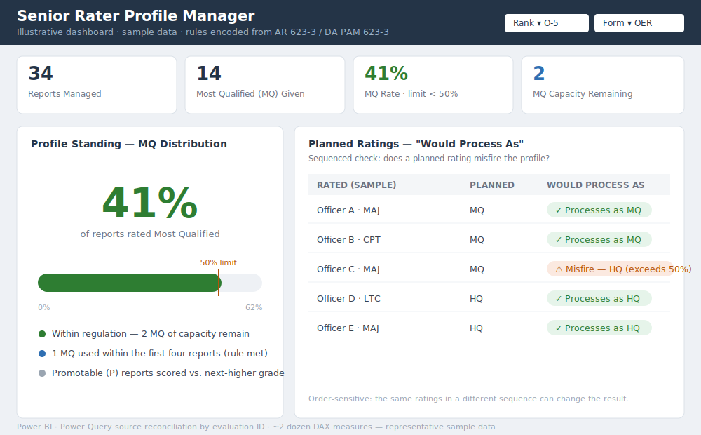

# Senior Rater Profile Manager — Case Study

*Representative dashboard view — illustrative layout with sample data (no real
evaluation data).*

## Overview
The Senior Rater Profile Manager is a Power BI decision-support tool that helps
senior raters manage their evaluation profiles with confidence. It shows a
rater's current box-check distribution against Army regulatory limits and lets
them model the impact of planned ratings *before* those ratings are ever
submitted.

## Problem
Senior raters must keep their officer (MQ/HQ) and NCO box-check distributions
within the limits set by AR 623-3 and DA PAM 623-3. Those rules are deceptively
complex — they vary by rank, evaluation form, and promotable status, carry
"first-N-report" constraints, and include special cases such as colonel-form
thresholds and one-time credits. A single mis-sequenced rating can quietly
"misfire" a profile. Most raters track this by hand and have no easy way to see
their current standing or to test "what happens if I rate this Soldier this
way?" before committing.

## Solution
I built a data model and rule engine that:
- Ingests evaluation-system exports and the senior rater's profile history and
  reconciles them by evaluation ID (not row position), de-duplicating records
- Encodes the AR 623-3 / DA PAM 623-3 business rules as logic — per-rank limits,
  first-N constraints, form-specific thresholds, one-time credits, NCO box-check
  ceilings, and promotable-vs-next-grade pooling
- Provides a library of calculated measures, including a sequenced
  **"would process as"** check that flags whether a planned rating would misfire
  the profile
- Includes a planning workbook where the rater enters intended ratings and
  immediately sees the projected effect on their profile

## My Role
I designed the entire data model, translated the regulations into encoded
business logic, authored the full measure library, and wrote the methodology
documentation. I validated the rule set directly against the current editions of
AR 623-3 and DA PAM 623-3.

## Impact
- Gives senior raters clear, at-a-glance visibility into their current profile
- Lets them test planned ratings before submission and avoid misfires
- Converts complex, error-prone policy into reliable, repeatable automated logic
- Reduces reliance on manual tracking and individual interpretation

## Why This Matters for ASWF
This project demonstrates my ability to:
- Model data and reconcile messy source systems into a clean analytical model
- Translate dense written policy into correct, testable software logic
- Build analytics and decision-support that reduce error and administrative load
- Deliver a tool that leaders actually use to make better decisions

*Built with Power BI (Power Query, DAX). Developed and demonstrated with
non-sensitive sample data. The image above is an illustrative representation of
the dashboard layout; live screenshots from the sample-data build can be
substituted here.*
