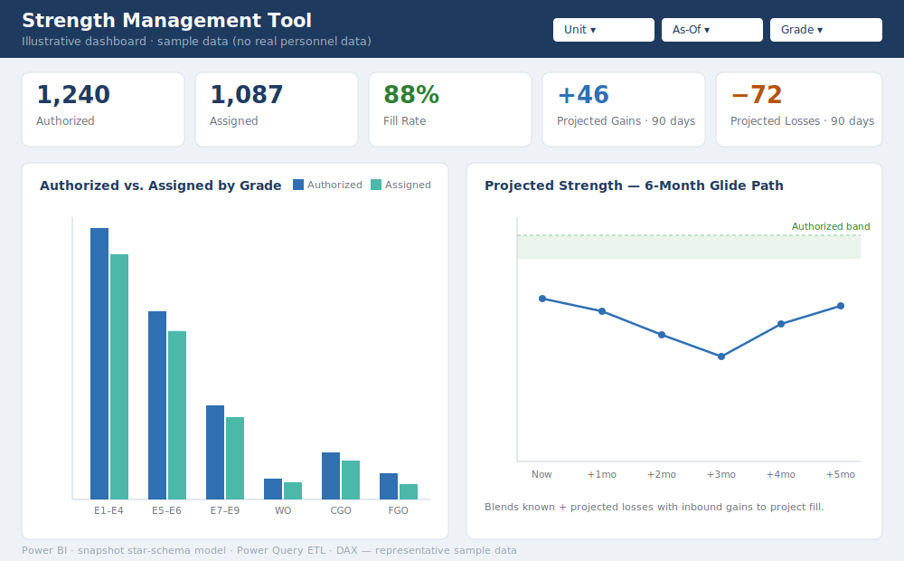

# Power BI Dashboards

Data models and dashboards I've built in Power BI to support readiness,
evaluations, and HR operations. My Power BI work goes beyond charts — it
includes real data-engineering: Power Query ETL pipelines, star-schema and
snapshot data models, and DAX measure libraries that encode business rules and
drive decision-support.

All screenshots and examples use non-sensitive sample data.

## Featured builds

### Senior Rater Profile Manager
A rule engine that encodes AR 623-3 / DA PAM 623-3 evaluation-profile logic and
lets senior raters model planned ratings before they misfire a profile.
Highlights: source reconciliation by evaluation ID, a regulatory rule set
expressed as DAX, and a sequenced "would process as" misfire check.

→ **[Full case study](Army-Projects/Senior-Rater-Profile-Manager.md)**

### Strength Management Tool
A snapshot star-schema suite that consolidates multiple personnel-system exports
into authorized-vs-assigned strength, gains/losses, and forward force
projection. Highlights: a snapshot data warehouse for point-in-time and trend
analysis, conformed dimensions for unit/date/grade/specialty, and a
force-projection glide path.

→ **[Full case study](Army-Projects/Strength-Management-Tool.md)**

## Skills demonstrated
- **Data modeling** — star schema, conformed dimensions, snapshot warehousing
- **ETL / Power Query** — folder connectors, multi-source integration, cleaning
  irregular exports, deterministic date stamping
- **DAX** — measure libraries, time-intelligence, encoded business rules
- **Decision-support design** — turning raw system data into views leaders act on

## About these visuals
The images above are **illustrative representations** of the dashboard layouts,
built with sample data so the design and capabilities are visible publicly. Live
screenshots from the sample-data builds can be dropped in to replace them.

<!-- To swap in a real screenshot:
     1. Put the image in this "images/" folder.
     2. Update the reference, e.g. 
     Use only sample/dummy-data views — no CUI or real unit data. -->
